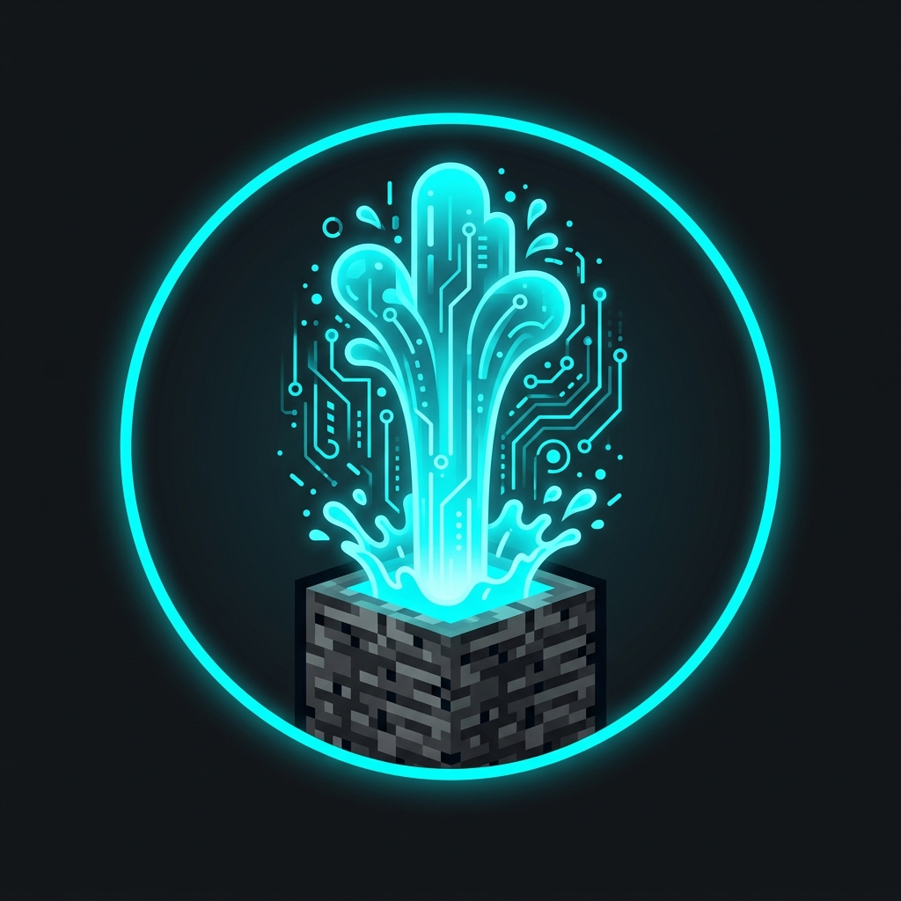

<p align="center">
  
</p>

<h1 align="center">Geyser Paper 26.3 Fix</h1>

<p align="center">
  <strong>CraftItemStack reflection patch and automated bytecode patcher for Geyser-Spigot on Paper 26.3+.</strong><br>
  Fixes the fatal <code>asCraftMirror</code> NoSuchMethodException / IllegalArgumentException crash on server startup.
</p>

<p align="center">
  
  
  
  
  
</p>

<p align="center">
  <a href="#summary">Summary</a> &middot;
  <a href="#root-cause">Root cause</a> &middot;
  <a href="#the-fix">The fix</a> &middot;
  <a href="#quickstart">Quickstart</a> &middot;
  <a href="#verification">Verification</a> &middot;
  <a href="#bedrock-protocol-note-paper-263--viabackwards">Protocol note</a>
</p>

---

## Summary

When launching Geyser-Spigot on Paper 26.3, the plugin aborts during server startup with an unhandled exception inside command registration:

```text
[Server thread/ERROR]: [Geyser-Spigot] Error occurred while enabling Geyser-Spigot v2.6.2-SNAPSHOT (Is it up to date?)
java.lang.ExceptionInInitializerError: null
    at org.geysermc.geyser.platform.spigot.shaded.org.incendo.cloud.bukkit.parser.ItemStackParser.parser(ItemStackParser.java:48)
    ...
Caused by: java.lang.IllegalArgumentException: Couldn't find asBukkitCopy or asCraftMirror method on CraftItemStack
    at org.geysermc.geyser.platform.spigot.shaded.org.incendo.cloud.bukkit.parser.ItemStackParser$ModernParser.<clinit>(ItemStackParser.java:79)
```

Geyser fails to enable, refusing all incoming Bedrock connections on UDP port `19003`.

---

## Root Cause

| Component | Target | Behavior |
|---|---|---|
| **Paper 26.3** | `CraftItemStack.asBukkitCopy(...)` | Parameter changed to `ItemInstance` in internal mappings |
| **incendo.cloud** | `ItemStackParser$ModernParser.<clinit>` | Falls back to reflection for `asCraftMirror(ItemStack)` |
| **CraftBukkit** | `org.bukkit.craftbukkit.inventory.CraftItemStack` | Method has always been named **`asBukkitMirror(ItemStack)`** |

In `ItemStackParser$ModernParser.<clinit>`, reflection is used to obtain a method that converts internal NMS items into Bukkit `ItemStack` objects:

```java
// What cloud-bukkit does:
firstNonNullOrThrow(
    () -> findMethod(CraftItemStack.class, "asBukkitCopy", ...),
    () -> findMethod(CraftItemStack.class, "asCraftMirror", ...), // <-- Typo! Method does not exist
    () -> new IllegalArgumentException("Couldn't find asBukkitCopy or asCraftMirror method on CraftItemStack")
);
```

Because CraftBukkit implements `asBukkitMirror(net.minecraft.world.item.ItemStack)` rather than `asCraftMirror`, both reflection lookups fail, triggering the `IllegalArgumentException` and killing plugin initialization.

---

## The Fix

Instead of waiting for an upstream Geyser rebuild or recompiling shaded dependencies from source, this patch modifies the compiled bytecode of `ModernParser.class` directly in the JAR constant pool:

- **Target Class:** `org/geysermc/geyser/platform/spigot/shaded/org/incendo/cloud/bukkit/parser/ItemStackParser$ModernParser.class`
- **Constant Pool Entry #336:**
  - Original: `CONSTANT_Utf8` (13 bytes) `asCraftMirror` (`\x01\x00\x0dasCraftMirror`)
  - Patched: `CONSTANT_Utf8` (14 bytes) `asBukkitMirror` (`\x01\x00\x0easBukkitMirror`)

All constant pool indexes, opcodes, and stack maps remain valid. The JVM resolves `CraftItemStack.asBukkitMirror` on the first call, allowing the parser to initialize cleanly.

---

## Quickstart

### 1. Requirements
- Python 3.8+ (no third-party pip dependencies, uses standard library only)
- Java 21+ runtime for your Minecraft server

### 2. Patching the JAR

Clone the repo and patch your `Geyser-Spigot.jar`:

```bash
git clone https://github.com/naoldavid/geyser-paper-26.3-fix.git
cd geyser-paper-26.3-fix

# Option A: Generate a new patched jar
python patch_geyser.py /path/to/plugins/Geyser-Spigot.jar

# Option B: Patch in-place (automatically creates a .bak backup)
python patch_geyser.py --in-place /path/to/plugins/Geyser-Spigot.jar
```

### 3. Check status

Verify whether your existing JAR needs the patch:

```bash
python patch_geyser.py --check /path/to/plugins/Geyser-Spigot.jar
```

---

## Verification

Tested on **Paper 26.3 build 31** (Linux x86_64, OpenJDK 21):

```text
[Server thread/INFO]: [Geyser-Spigot] Enabling Geyser-Spigot v2.6.2-SNAPSHOT
[Server thread/INFO]: [Geyser-Spigot] Started Geyser on 0.0.0.0:19003
[Server thread/INFO]: [floodgate] Floodgate player logged in as .BedrockUser joined
[Server thread/INFO]: System chat: .BedrockUser joined the game
```

Bedrock players can join and execute commands with zero reflection crashes or errors in server console.

---

## Bedrock Protocol Note (Paper 26.3 + ViaBackwards)

If your Bedrock clients are running on the current release branch (targeting 1.21.3 / 1.21.4 protocol translations) while Paper 26.3 runs the latest network protocol, install:
- **[ViaVersion](https://hangar.papermc.io/ViaVersion/ViaVersion)**
- **[ViaBackwards](https://hangar.papermc.io/ViaVersion/ViaBackwards)**

This ensures Bedrock packets translated by Geyser are accepted by the Paper 26.3 packet pipeline.

---

## License

MIT License — see [LICENSE](LICENSE) for details.
